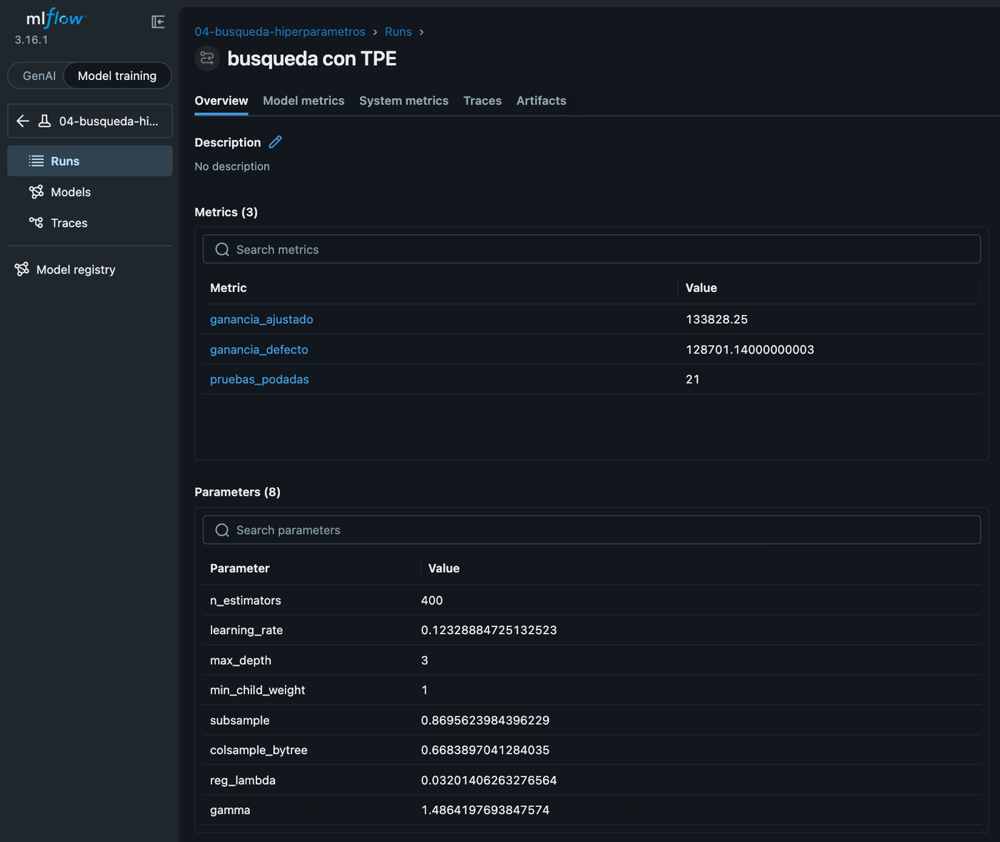
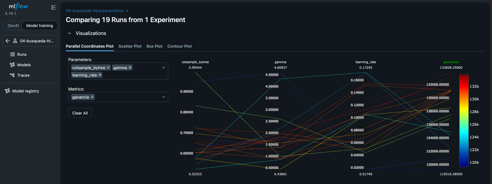

# Mercado Libre Fraud Detection Challenge

## Ejecución con Docker

Docker es la forma recomendada de ejecutar el proyecto: la imagen empaqueta el
entorno completo, con las mismas versiones que fija `uv.lock`. Si no está
instalado, descargar
[Docker Desktop](https://www.docker.com/products/docker-desktop/) y seguir la
[guía de instalación](https://docs.docker.com/desktop/).

Todos los comandos de este README se ejecutan desde la raíz del repositorio,
porque lo que se comparte con el contenedor es la carpeta actual.

Construir la imagen una vez:

```shell
docker build -t meli-fraud .
```

El CSV del enunciado debe ubicarse en:
`data/MercadoLibre Data Scientist Technical Challenge - Dataset.csv`.
La carpeta `data/` está excluida de Git y de la imagen Docker.

Iniciar Jupyter Lab con:

```shell
docker run --rm -it \
  -p 127.0.0.1:8888:8888 \
  -v "$PWD:/workspace" \
  meli-fraud
```

El montaje `-v "$PWD:/workspace"` comparte el proyecto local con el contenedor.
Así puede leer el CSV y conservar notebooks, modelos y resultados generados sin
incorporarlos a la imagen. Abrir
[http://localhost:8888](http://localhost:8888): no pide token, porque el puerto
se publica solo en `127.0.0.1` y no queda accesible desde la red.

## Notebooks

Se ejecutan en orden, cada uno con un kernel nuevo:

| Notebook | Contenido |
| --- | --- |
| `01_eda.ipynb` | Calidad, economía, patrones de fraude y su estabilidad. |
| `02_feature_engineering.ipynb` | Transformaciones y controles de leakage. |
| `03_modeling.ipynb` | Modelos, calibración, desbalanceo y validación. |
| `04_tuning.ipynb` | Optuna sin usar el período reservado. |
| `05_evaluation.ipynb` | Evaluación final, SHAP, persistencia y monitoreo. |

El EDA reserva como test el período desde el 13 de abril de 2020 y no lo usa para
ninguna decisión. Cada variable se mide en ganancia y no solo en tasa de fraude:
la vara de `score` se calcula eligiendo el corte con el pasado de cada fold y
midiéndolo en su futuro, y cada patrón de fraude se reporta con su exposición
en monto y con la ganancia que produciría rechazar ese segmento. Evalúa con los
datos las dos preguntas abiertas del enunciado: si `score` es una fuga de
información y si las etiquetas tienen demora de confirmación.

Sobre el período reservado, el modelo elegido —XGBoost con umbral 0,2— rinde
**+47.567 sobre aprobar todo**, contra **+23.201** de la mejor regla de un corte
sobre `score`: captura el 40% de la ganancia que estaba en disputa y deja pasar
803 fraudes contra 1.571. Sin la columna `score`, cuya disponibilidad al decidir
el pago sigue sin confirmarse, rinde **+37.867**, todavía 1,6 veces la regla
actual.

Cada decisión de modelado se toma midiendo y se deja el resultado negativo
escrito: las cuatro técnicas de manejo del desbalanceo empeoran la ganancia, las
dos calibraciones también, Isolation Forest no encuentra ningún patrón de fraude
nuevo, y del ajuste de hiperparámetros —+5.127 en validación— sobrevivieron
**+164** sobre datos nuevos.

**No se persiste ningún dataset procesado.** El target encoding de las categóricas
de alta cardinalidad se ajusta con el train de cada fold, dentro del Pipeline. El
único artefacto que se guarda es el Pipeline entrenado —`models/`, excluida de Git—,
nunca la tabla de features; `02_feature_engineering.ipynb` verifica esa separación
con cuatro chequeos y `05_evaluation.ipynb` comprueba que el artefacto recuperado
reproduce las mismas probabilidades.
`RANDOM_STATE` está fijado en `constants.py` para que los números sean
reproducibles entre corridas.

## Estructura del paquete

| Módulo | Contenido |
| --- | --- |
| `constants.py` | Contrato de datos, reglas de negocio y configuración. |
| `paths.py` | Rutas del proyecto, resueltas desde la raíz. |
| `dataset.py` | Carga, validación del contrato y reserva temporal. |
| `diagnostics.py` | Diagnósticos de riesgo y exposición. |
| `plots.py` | Gráficos de distribución, riesgo y ganancia. |
| `evaluation.py` | Ganancia, umbrales y barridos de cortes. |
| `features.py` | Preprocesamiento y `FrequencyEncoder`. |
| `modeling.py` | Folds temporales sobre días calendario. |
| `training.py` | Armado, entrenamiento y persistencia del modelo. |
| `tuning.py` | Búsqueda de hiperparámetros con Optuna. |
| `tracking.py` | Registro de experimentos en MLflow. |
| `logs.py` | Registro de cada corrida en consola y archivo. |
| `cli.py` | Comandos para correr el pipeline desde la terminal. |

`diagnostics.py` y `plots.py` son herramientas de análisis e informes, no
transformadores de producción; `features.py` sí produce las entradas del modelo.
Los docstrings siguen el formato NumPy.

## Ejecución completa

Ejecutar los cinco notebooks, en orden y sin abrir la interfaz:

```shell
docker run --rm -v "$PWD:/workspace" meli-fraud sh -c '
  set -e
  uv run --locked jupyter execute notebooks/01_eda.ipynb --inplace
  uv run --locked jupyter execute notebooks/02_feature_engineering.ipynb --inplace
  uv run --locked jupyter execute notebooks/03_modeling.ipynb --inplace
  uv run --locked jupyter execute notebooks/04_tuning.ipynb --inplace
  uv run --locked jupyter execute notebooks/05_evaluation.ipynb --inplace
'
```

`03` y `04` tardan alrededor de dos minutos cada una; el resto, segundos.

Sin Docker, con el entorno local ya instalado (ver
[Ejecución local alternativa](#ejecución-local-alternativa)):

```shell
for notebook in notebooks/0*.ipynb; do
  uv run --locked jupyter execute "$notebook" --inplace || break
done
```

`--inplace` guarda las salidas en el mismo archivo, así que `git diff` muestra
qué número cambió. Con las semillas fijas, entre dos corridas solo deberían
cambiar tiempos, identificadores de MLflow y el conteo de corridas registradas.

## Experimentos con MLflow

Las corridas de `03`, `04` y `05` quedan registradas en MLflow, con store SQLite
en `mlflow.db` y artefactos en `mlartifacts/`, los dos excluidos de Git porque se
regeneran al ejecutar los notebooks. Después de ejecutar los notebooks, iniciar
la interfaz con:

```shell
docker run --rm -it \
  -p 5001:5000 \
  -v "$PWD:/workspace" \
  meli-fraud \
  uv run --locked mlflow server \
    --backend-store-uri sqlite:////workspace/mlflow.db \
    --host 0.0.0.0 \
    --port 5000
```

Abrir [http://localhost:5001](http://localhost:5001). Desde **Experiments** se
pueden abrir las corridas, comparar parámetros y métricas, y revisar sus
etiquetas y artefactos. La documentación oficial describe estas vistas en
[MLflow Tracking](https://mlflow.org/docs/latest/ml/tracking/).

| Experimento | Qué contiene |
| --- | --- |
| `03-comparacion-modelos` | Modelos con/sin `score` y desbalanceo. |
| `04-busqueda-hiperparametros` | Búsqueda y pruebas de Optuna. |
| `05-evaluacion-final` | Evaluación reservada y modelo final. |

La interfaz abre en modo GenAI: la primera vez, elegir **Model training** arriba
a la izquierda, y queda recordado. La búsqueda de `04` guarda la mejor
configuración y su ganancia contra la de defecto:



Y comparando sus pruebas se ve cómo cambia la ganancia con cada hiperparámetro:



`04_tuning.ipynb` deja su configuración en `models/mejores_parametros.json`, que
es lo que `05_evaluation.ipynb` carga para entrenar el modelo final. Esa
separación es lo que hace que el período reservado se use una sola vez.

## Línea de comandos

El pipeline también corre sin abrir Jupyter. Los comandos delegan en el mismo
código que usan los notebooks, así que no hay dos caminos que puedan divergir:

```shell
uv run fraud-detection tune --trials 40   # busca hiperparámetros
uv run fraud-detection train              # entrena y guarda el artefacto
uv run fraud-detection evaluate           # mide sobre el período reservado
uv run fraud-detection all                # las tres etapas, en orden
uv run fraud-detection all --help         # opciones de cada comando
```

Dentro de la imagen es el mismo comando, con el proyecto montado para que el
CSV se lea y los artefactos queden en el disco local:

```shell
docker run --rm -v "$PWD:/workspace" meli-fraud \
  uv run --locked fraud-detection all
```

Algunos usos habituales:

```shell
# Probar el circuito completo rápido, con pocas pruebas de Optuna.
uv run fraud-detection all --trials 3

# Reentrenar con la configuración ya elegida, sin volver a buscar.
uv run fraud-detection train

# Ver también el detalle por bloque de validación.
uv run fraud-detection tune -v

# Guardar solo la tabla final; los logs siguen saliendo por la terminal.
uv run fraud-detection evaluate > resultado.txt
```

Así se ve una corrida de `tune` (abreviada):

```text
23:02:48 INFO    fraud_detection.logs | corrida all | log en logs/all-20260917-230248.log
23:02:48 INFO    fraud_detection.dataset | contrato de datos verificado
23:02:49 INFO    fraud_detection.tuning | búsqueda: 40 pruebas sobre 4 bloques
23:02:51 INFO    fraud_detection.tuning | prueba 1/40: ganancia +124322 (mejor +124322)
...
23:04:24 INFO    fraud_detection.cli | 40 pruebas, 21 podadas
23:04:25 INFO    fraud_detection.logs | terminado en 97 s
```

Cada etapa lee de disco lo que dejó la anterior y escribe su propia salida:

| Etapa | Lee | Escribe |
| --- | --- | --- |
| `tune` | CSV | `mejores_parametros.json`, `pruebas_optuna.csv`, MLflow |
| `train` | CSV y el JSON | `xgboost.joblib` |
| `evaluate` | CSV y el joblib | `evaluacion_reservado.csv` y la tabla |

`tune` y `train` están separados a propósito: buscar hiperparámetros es caro y
se hace pocas veces, reentrenar es barato y se repite con cada dato nuevo. El
JSON es el contrato entre las dos, así que reentrenar no obliga a buscar de nuevo.

Todas las etapas validan el contrato de datos antes de empezar y cortan ante un
CSV con fechas, etiquetas o montos inválidos. El progreso sale por la terminal
y la corrida completa, con el detalle por bloque, queda en
`logs/<comando>-<fecha>.log`, excluida de Git. `-v` muestra ese detalle también
en la terminal. La tabla de `evaluate` va por la salida estándar y los logs por
la de errores, así que `fraud-detection evaluate > resultado.txt` guarda solo la
tabla. En los notebooks esos logs no aparecen: solo la CLI los configura.

Respecto de la versión anterior de la CLI, los comandos `tune`, `train` y
`evaluate` se usan igual. Lo nuevo es:

- `all`, que corre las tres etapas en orden.
- `-v`, para ver el detalle por bloque, y el archivo de log de cada corrida.
- `tune` registra en el experimento `04-busqueda-hiperparametros` y escribe el
  mismo JSON que `04_tuning.ipynb`, incluida la ganancia de la configuración
  por defecto.
- `evaluate` además guarda su tabla en `models/evaluacion_reservado.csv`.
- Si una etapa falla, el traceback queda en el log y el comando sale con
  código 1.

## Controles de calidad

Ejecutar todos los hooks dentro de la imagen:

```shell
docker run --rm -v "$PWD:/workspace" meli-fraud \
  uv run --locked pre-commit run --all-files
```

Los tests corren sin el CSV, así que funcionan sobre un clon recién bajado:

```shell
docker run --rm -v "$PWD:/workspace" meli-fraud uv run --locked pytest
```

Pylint y mypy también pueden comprobarse individualmente:

```shell
docker run --rm -v "$PWD:/workspace" meli-fraud \
  uv run --locked pylint src/fraud_detection
docker run --rm -v "$PWD:/workspace" meli-fraud \
  uv run --locked mypy src/fraud_detection
```

Black formatea el código Python y las celdas de los notebooks. Pylint, mypy y
pytest se aplican a `src/` y `tests/`; markdownlint revisa los archivos Markdown.
La cobertura excluye `plots.py`, `tracking.py` y `cli.py`, por los motivos
anotados en `pyproject.toml`.

## Ejecución local alternativa

Docker evita instalar Python y OpenMP directamente. Si se prefiere trabajar sin
contenedor, usar Python 3.11 y `uv` desde la raíz:

```shell
uv sync --locked
uv run --locked jupyter lab
```

`uv sync` crea el entorno en `.venv/`. `uv run` lo usa sin activarlo; si se
prefiere activarlo una vez por terminal y escribir los comandos sin prefijo:

```shell
source .venv/bin/activate
jupyter lab
fraud-detection all
deactivate            # para salir del entorno
```

En macOS, XGBoost necesita además el runtime de OpenMP:

```shell
brew install libomp
```

Las rutas se resuelven desde la raíz del repositorio, así que los notebooks
corren desde cualquier directorio. `.vscode/settings.json` ya apunta VS Code
a `.venv/bin/python`; si los imports no resuelven, es que está seleccionado
otro intérprete. Para correr un notebook desde VS Code, elegir como kernel el
Python de `.venv` (**Select Kernel → Python Environments → .venv**).
Para instalar y ejecutar los hooks localmente:

```shell
uv run pre-commit install
uv run pre-commit run --all-files
```
