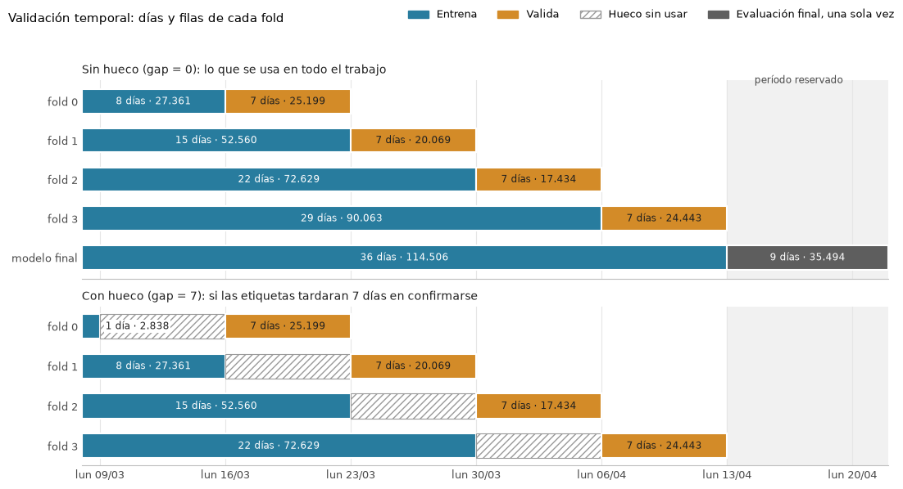
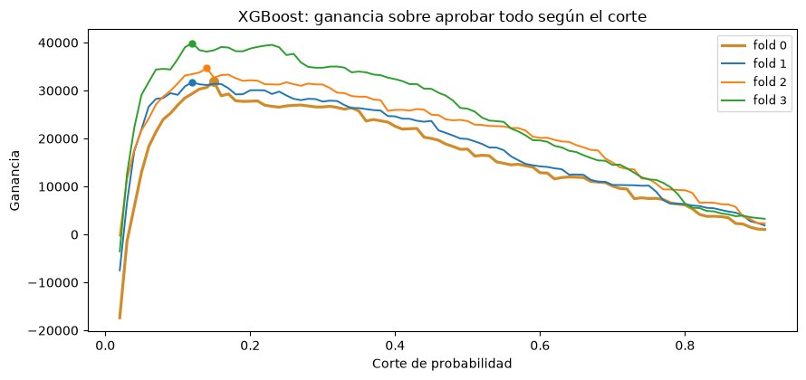
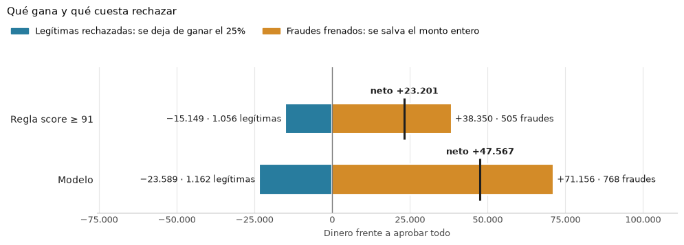

# **Detección de fraude: maximizar la ganancia**

**Data Scientist Technical Challenge — Fraud Prevention Fintech**

Cada número de este informe sale de la salida de una celda de los cinco notebooks del repositorio [mercadolibre-fraud-detection](https://github.com/matimoya/mercadolibre-fraud-detection). Al cierre de cada sección se indica dónde verificarlo.

# **1\. Hipótesis**

El enunciado pide **maximizar la ganancia**. Cada transacción legítima aprobada rinde el 25% de su monto, cada fraude aprobado pierde el 100%, y las rechazadas no suman ni restan.

ganancia \= 0,25 × (monto de las legítimas aprobadas) \- (monto de los fraudes aprobados)

Aprobar conviene cuando 0,25 × monto × (1 \- p) \- monto × p \> 0. Al dividir por el monto —todos son estrictamente positivos— el monto desaparece de la desigualdad y queda **p \< 0,2**.

Dejar pasar un fraude cuesta el monto entero; frenar una legítima cuesta solo el 25% que habría rendido. Un fraude pesa lo mismo que cuatro legítimas del mismo monto. Entonces, si de cada cinco transacciones que freno una es fraude, el fraude que evito paga justo las cuatro legítimas que resigno: ese es el punto de equilibrio, y es el 20%.

**El monto sale de la cuenta, pero no deja de importar.** El corte es el mismo para la transacción de 0,02 que para la de 3.696; lo que cambia es cuánto cuesta equivocarse en cada una. Por eso todo el informe se mide en dinero y no en cantidad de transacciones.

**Hipótesis central.** El fraude se puede anticipar a partir de las características de cada transacción con la precisión suficiente para que rechazar las que superan un 20% de probabilidad de fraude deje más ganancia que aprobarlas todas. Y como esa decisión depende de un único corte, la ganancia debería depender más de qué información se usa para estimar el riesgo y del umbral con que se decide que del algoritmo elegido.

**Supuestos a confirmar con el equipo de Prevención de Fraude:**

* Que los montos estén en una moneda común, porque no hay columna de moneda. Las medianas por país son del mismo orden (19,00 en BR, 29,22 en AR): es compatible con una moneda común, pero no lo confirma.
* Que las columnas o y score se hayan generado en el momento de cada transacción y no recalculado después. Son las dos variables más importantes del modelo y las dos parecen venir de un sistema anterior; si alguna se recalculara con información posterior al resultado de la transacción, sería fuga y habría que descartarla. **Por eso el modelo se midió con y sin score**: la respuesta cambia cuánto se gana, no si conviene el modelo.
* Que un fraude se confirme rápido. Una transacción recién queda marcada como fraude cuando alguien lo confirma, y eso puede tardar días; por eso, al reentrenar, los días más recientes no se pueden usar. Esa demora define el gap: los días que se dejan sin usar entre el entrenamiento y la validación. El archivo no dice cuánto tarda esa confirmación, así que se midió cuánto costaría: con un gap de 7 días, la ganancia en validación baja 8,4%, aun con el primer fold entrenando con un solo día.
* Que rechazar no tenga costo operativo — si lo tuviera, ese costo no escala con el monto y el umbral dejaría de ser 0,2 para todos.

*Detalle: 01\_eda.ipynb §1 y §4 · 03\_modeling.ipynb §2.*

# **2\. Análisis y transformaciones del dataset**

150.000 transacciones, 19 columnas, 45 días. Salvo fecha, monto, score y fraude, los nombres son solo letras y no hay diccionario de datos, así que las variables se analizaron por cómo se comportan. No hay columna de moneda, ni identificador de usuario, ni la decisión de aprobación o rechazo del sistema actual.

**Partición temporal.** Los últimos **9 días (35.494 transacciones, 23,7%)** se apartaron y no se tocaron hasta el final; quedan 36 días y 114.506 transacciones para usar durante el desarrollo. El corte es por fecha y no al azar porque en producción el modelo siempre predice sobre transacciones posteriores a las que vio al entrenar.

**Cuatro folds temporales.** Dentro de desarrollo, cada decisión se midió igual que en producción: entrenar con el pasado y medir en la semana siguiente. Los 36 días se parten en cuatro bloques de validación de una semana, de lunes a domingo, del 16/03 al 12/04, y cada uno se mide con un modelo entrenado con todo lo anterior: de 8 a 29 días. Cuatro es el único número de bloques que da semanas completas. Es lo que el resto del informe llama «los cuatro bloques».

*Qué entrena y qué valida cada bloque. Abajo, el mismo esquema si las etiquetas tardaran una semana en confirmarse.*

**No se eliminó nada del dataset.** No hay duplicados ni etiquetas en conflicto. Sí hay nulos, y las limpiezas por reflejo salen caras cuando la clase de interés (fraude) es el 5%:

| Operación habitual | Qué costaría |
| :---- | :---- |
| Eliminar toda fila con algún nulo | **75,7% de las transacciones y 38,9% de los fraudes** |
| Recortar los montos atípicos por rango intercuartílico (11.213 transacciones, el 9,8%) | **16,75% de los fraudes** |

Atípico no quiere decir error: esos montos tienen más fraude que el resto (8,86% contra 4,78%), así que recortarlos se lleva justo lo que se quiere detectar.

**Qué variables predicen el fraude, y cuánto vale cada una en dinero.** Ordenar por tasa de fraude engaña. Cada grupo se midió por cuánto cambiaría la ganancia si se lo rechazara entero:

| Grupo | % de las transacciones | Fraude | Ganancia si se rechaza |
| :---- | :---- | :---- | :---- |
| o \= N | 11,33% | 22,74% | **\+109.637** |
| n \= 0 | 9,61% | 16,80% | \+44.102 |
| score ≥ 90 | 9,54% | 21,18% | \+33.369 |
| h \= 0 | 8,54% | 9,57% | **\-55.891** |
| p \= N | 44,35% | 7,92% | **\-211.313** |

Detrás de los signos hay una regla exacta, verificada en los diez grupos medidos: **rechazar un grupo conviene exactamente cuando más del 20% de su monto está en fraude.** Es el mismo 0,2 aplicado a un grupo, y muestra que lo que importa es la participación del fraude en el **monto**, no en la cantidad de transacciones.

**La variable más valiosa es o, y lo es porque su ausencia informa.** Falta en el 72,5% de las filas y ese grupo tiene apenas 2,11% de fraude, contra 22,74% de o \= N. De ahí una decisión concreta: el indicador de "este valor falta" es una columna explícita del modelo, no algo a imputar y olvidar.

**Entre las numéricas, cuatro separan el fraude casi tanto como score.** En f, l, m y d, a más valor, menos fraude: en f, el 20% de las transacciones con los valores más bajos tiene 11,14% de fraude, y el 20% más alto, 1,95%. El monto, en cambio, casi no separa; su papel es poner el precio de cada error. Las 11 numéricas entran al modelo tal cual: ninguna se descarta por separar poco.

**Las 33 columnas que recibe el modelo** (32 sin score), cada una desde un hallazgo concreto:

| Hallazgo | Columna que produce |
| :---- | :---- |
| La ausencia de o informa | o con "ausente" como categoría propia, más un indicador de faltante por cada numérica con nulos (6) |
| a no tiene orden: su tasa de fraude sube y baja entre sus 4 valores | Las 4 categorías por separado, nunca como número |
| j tiene 7.770 valores y su frecuencia predice sola (3,21% de fraude en los que aparecen una vez, 6,79% en los de más de 500\) | j codificada por tasa de fraude **y** por frecuencia: miden cosas distintas |
| La madrugada tiene más del doble de fraude | La hora en dos columnas cíclicas más un indicador de madrugada |

No hay perfil por usuario porque el dataset no trae identificador, ni columnas de calendario porque día de semana y fin de semana no separan (4,93%–5,45%). k se conserva a propósito **como vara de ruido** —AUC 0,5061—: cualquier columna que pese menos que k está compitiendo con ruido puro.

*Detalle: 01\_eda.ipynb §1–§3 y §5–§6 · 02\_feature\_engineering.ipynb, que documenta además los cuatro chequeos contra fuga de información por la codificación de j y g.*

# **3\. Modelos utilizados**

El modelo se entrena minimizando **log loss**, una pérdida que en promedio se minimiza cuando la probabilidad predicha coincide con la real. Los **hiperparámetros se seleccionan por la métrica económica** que define el problema —la ganancia en dinero— medida **fuera de muestra con validación temporal**. Y el **umbral 0,2 permanece fijo**, porque surge de la regla de negocio y no se ajusta sobre la validación como si fuera un parámetro más. El accuracy no aparece en ninguna tabla: aprobar todo acierta el 94,8% de las veces sin detectar un solo fraude.

**La vara a superar** es decidir solo con score: rechazar toda transacción con score igual o mayor que un corte y aprobar el resto. El corte se elige probando todos los valores posibles y quedándose con el que más ganancia deja en los datos disponibles: sobre los 36 días de desarrollo, es 91. Para compararla con los modelos se mide igual que ellos: en cada fold, el corte se elige solo con los días anteriores a su semana de validación, y se mide en esa semana. Así, la regla deja **\+23.999** sobre aprobar todo.

Los tres modelos reciben las mismas columnas y se miden sobre los mismos cuatro bloques temporales con el mismo umbral. Ganancia sobre aprobar todo:

| Modelo | Con score | Sin score | AUC |
| :---- | :---- | :---- | :---- |
| Regresión logística | \+127.416 | \+110.520 | 0,8434 |
| Random Forest | \+125.769 | \+105.717 | 0,8734 |
| **XGBoost** | **\+128.701** | \+109.094 | **0,8834** |
| *Regla de un corte sobre score* | *\+23.999* | — | — |

**Lo importante no es cuál gana, sino por cuánto.** Los tres rinden más de cinco veces la vara, y entre el mejor y el peor hay apenas un **2,3%**: la regresión logística queda a 1.285 de XGBoost aunque tiene 0,04 menos de AUC. Más AUC no se traduce en más dinero porque miden cosas distintas: el AUC evalúa cómo el modelo ordena *todas* las transacciones, de la más segura a la más riesgosa, mientras que la decisión solo pregunta de qué lado del 0,2 cae cada una. Ordenar mejor transacciones que quedan lejos de ese corte no cambia ninguna decisión. Sin score, la ganancia baja entre 13% y 16% según el modelo.

**Un solo modelo para todos los países.** Se decidió en validación, antes de tocar el período reservado: BR aporta \+114.680 y AR \+14.059, aunque a AR le frena menos fraude (38,2% contra 47,6% de BR). El único negativo es Uruguay, \-161 con 23 fraudes, un volumen que no alcanza para concluir.

Cuatro cosas se probaron midiendo en vez de suponiendo, y **ninguna mejoró al modelo**:

| Qué se probó | Resultado |
| :---- | :---- |
| Cuatro técnicas para clases desbalanceadas | scale\_pos\_weight hunde la ganancia a **\+3.846**: rompe la escala de las probabilidades y el 0,2 deja de significar lo mismo |
| Ponderar el entrenamiento por monto y por costo del error | Peor **incluso con su mejor corte posible** (129.835 contra 138.131). El monto ya está contemplado en la decisión, vía el umbral |
| Recalibrar las probabilidades | \+127.410 contra **\+128.701** sin corregir |
| Isolation Forest como columna extra | AUC 0,8321 → **0,8319**. Por sí solo ordena el fraude mejor que score (0,7511 contra 0,7264), pero como columna no agrega nada que las demás no aporten ya |

**El umbral 0,2 no se ajustó**, porque sale de la regla de negocio y no de los datos. Si en cada semana de validación se hubiera usado su mejor corte, se habría ganado 9.430 más (7,3%). Pero ese corte solo se conoce después de saber qué transacciones eran fraude, y cambia de semana a semana, entre 0,12 y 0,15. El período reservado le dio la razón al 0,2 (§4).

*Ganancia según el umbral, por bloque de validación*

**Ajuste de hiperparámetros.** Optuna sobre los mismos bloques, optimizando la ganancia y no el AUC: **\+5.127** sobre el modelo por defecto.

*Detalle: 03\_modeling.ipynb · 04\_tuning.ipynb.*

# **4\. Evaluación**

Una sola pasada sobre los 9 días reservados (35.494 transacciones, 4,43% de fraude), con el modelo entrenado sobre los 36 días de desarrollo.

| Política | Ganancia | % del máximo | Fraudes aprobados | Sobre aprobar todo |
| :---- | :---- | :---- | :---- | :---- |
| Aprobar todo | 226.254 | 65,70% | 1.571 | — |
| Regla score \< 91 | 249.456 | 72,44% | 1.066 | **\+23.201** |
| XGBoost por defecto | 273.657 | 79,46% | 807 | \+47.403 |
| **XGBoost ajustado** | **273.821** | **79,51%** | **803** | **\+47.567** |
| XGBoost ajustado sin score | 264.122 | 76,69% | 924 | \+37.867 |
| Máximo alcanzable | 344.381 | 100% | 0 | \+118.126 |

**El modelo agrega \+47.567 contra aprobar todo y \+24.366 contra la regla sobre score: poco más del doble.** Captura el 40% de lo que estaba en disputa, deja pasar 803 fraudes contra los 1.571 de aprobar todo, y para eso rechaza el 5,4% de las transacciones.

**El ajuste de hiperparámetros casi no cambió el resultado:** en validación, el modelo ajustado le ganaba al modelo por defecto por 5.127; en el período reservado, por apenas **164** (273.821 contra 273.657). Esa ventaja era casi toda suerte de haber elegido la mejor combinación entre muchas. **Y el umbral volvió a aguantar:** mirando ya los resultados, el mejor corte habría sido 0,19, apenas 728 más que el 0,2.

## **Qué gana y qué cuesta rechazar**

*Frente a aprobar todo, sobre el período reservado*

De las 1.930 transacciones que el modelo rechaza, solo 768 son fraude: 4 de cada 10 (precisión **0,3979**). En un problema de clasificación común sería un mal número; acá conviene, porque los dos errores no cuestan lo mismo. Rechazar las 1.162 legítimas cuesta 23.589, el 25% de su monto que se deja de ganar; frenar los 768 fraudes evita perder 71.156, su monto entero. La diferencia es exactamente el \+47.567. Frente a la regla sobre score, el modelo rechaza más legítimas, pero frena mucho más fraude: el **48,89%** contra el 32,15%.

## **Cuánto puede variar el resultado**

El resultado depende de qué transacciones cayeron en esos 9 días: con otras parecidas habría salido algo distinto. Para estimar cuánto, se simularon 2.000 períodos alternativos armados con las mismas transacciones (bootstrap) y se recalculó la ganancia en cada uno. En el 95% de las simulaciones, el resultado cayó en estos rangos:

|  | Resultado | Rango probable (95%) |
| :---- | :---- | :---- |
| Modelo | \+47.567 | 37.317 a 58.125 |
| Regla sobre score | \+23.201 | 16.581 a 30.575 |
| **Diferencia entre los dos** | **\+24.366** | **16.416 a 32.749** |

**El resultado varía, unos 22% para cada lado, pero la ventaja del modelo se mantiene:** incluso el extremo bajo del modelo (37.317) supera al extremo alto de la regla (30.575), y el modelo gana en las 2.000 simulaciones.

Esas simulaciones sortean transacciones sueltas, como si cada una no tuviera relación con las demás. Pero las de un mismo día se parecen entre sí: si un día hay mucho menos fraude que lo normal, como el 15/04, eso afecta a todas las de ese día a la vez. Por eso la variación real de un período a otro es algo mayor que la de la tabla, y también se miró día por día.

## **Por día y por país**

El modelo gana **8 de los 9 días**. El que pierde es el 15 de abril (-590), el día de menor fraude del período (2,24% contra 4,43%): con menos fraude que frenar, los rechazos equivocados no se compensan. Los días de fraude bajo son el escenario incómodo.

| País | Transacciones | Fraude | Modelo | Regla sobre score |
| :---- | :---- | :---- | :---- | :---- |
| BR | 25.187 | 5,09% | **\+40.188** | \+24.227 |
| AR | 8.587 | 2,85% | **\+4.847** | **\-914** |
| US | 665 | 3,61% | \+2.452 | \+99 |
| UY | 723 | 0,28% | \-19 | \-160 |
| Otros | 332 | 5,42% | \+98 | \-50 |

**En Argentina el modelo también gana, como ya mostraba la validación.** Le frena menos fraude que a BR (42,4% contra 50,5%), pero igual gana 4.847 donde la regla sobre score pierde 914.

**Qué mira el modelo.** score es lo que más pesa y la ausencia de o, lo segundo. De las cuatro numéricas que más separaban el fraude, l, m y f están entre las ocho columnas que más pesan. 17 de las 33 columnas pesan menos que k, la vara de ruido: son candidatas a poda, que queda pendiente.

*Detalle: 05\_evaluation.ipynb.*

# **5\. Conclusión**

**El modelo final es XGBoost, sin reponderar las clases, y rechaza una transacción cuando su probabilidad de fraude supera 0,2.** En los 9 días reservados, que no se usaron para ninguna decisión, deja **\+47.567** más que aprobar todo y **\+24.366** más que decidir solo con score: poco más del doble.

Si score resultara no estar disponible en el momento de decidir, el modelo sin esa columna deja **\+37.867**: menos, pero todavía 1,6 veces lo que deja decidir con score. Se entrega el modelo con score porque es el que más gana y nada en los datos indica que score se calcule con información posterior a la transacción (sin data leakage); el modelo sin score queda medido como reemplazo si se confirmara lo contrario. La misma duda vale para o, y para esa columna no hay un modelo de reemplazo medido.

**Como anticipaba la hipótesis, lo que movió la aguja fue la información y el umbral, no el algoritmo.** Entre las tres familias hay a lo sumo un 2,3% de diferencia, y del ajuste de hiperparámetros sobrevivieron \+164. En cambio, sacar score cuesta un 20% en el período reservado, y cambiar la escala de las probabilidades sin mover el 0,2 hunde la ganancia de validación a \+3.846. Lo segundo que más pesa en el modelo es la ausencia de o, que el análisis exploratorio llevó a tratar como una categoría propia.

**Pendiente:** medir la poda de las 17 columnas que pesan menos que la vara de ruido, y confirmar los supuestos abiertos con el equipo de Prevención de Fraude. Dos ya tienen su costo medido: sin score se gana un 20% menos en el período reservado, y una demora de etiquetas de una semana baja la ganancia de validación un 8,4%. Los otros —la moneda, cuándo se calcula o y el costo operativo de rechazar— no se pueden medir con estos datos.

# **Pregunta 3 — ¿Qué pasos puedo seguir para intentar asegurar que la performance del modelo en laboratorio será similar a la de producción?**

**Lo que ya se hizo en este trabajo:**

* **Validar contra el futuro, nunca al azar.** Todo se partió por fecha: cada bloque entrena con el pasado y se mide en la semana siguiente.
* **Aislar un conjunto de test.** Los últimos 9 días no participan de ninguna decisión —para elegir están los cuatro bloques de validación— y se miden una sola vez, al final, como si fueran producción. Así, el resultado que se reporta es el de datos que el modelo nunca vio.
* **Evitar la fuga de información.** Todo lo que se aprende de los datos, como la codificación de j y g por tasa de fraude, se ajusta solo con el entrenamiento de cada bloque; 02\_feature\_engineering.ipynb lo verifica.
* **Medir la sensibilidad a la demora de etiquetas** en vez de suponerla: si tardaran una semana en confirmarse, la ganancia baja un 8,4%.
* **Registrar cada experimento en MLflow**, con sus parámetros, métricas y artefactos, para poder revisar después por qué se eligió cada cosa; el README explica cómo abrirlo.

**Lo que falta hacer antes de confiar en el número:**

* **Validar el esquema de entrada como condición de servicio.** Es preferible una alerta a una predicción silenciosamente mala.
* **Correr en shadow** al menos el tiempo que tardan las etiquetas en confirmarse, comparando contra el sistema vigente.
* **Cambiar la referencia.** Los \+47.567 se miden contra *aprobar todo*, que es hipotético; la mejora real se mide contra la política vigente, y el período en sombra da ese número.

*Detalle: 02\_feature\_engineering.ipynb §2 · 03\_modeling.ipynb §2.*

# **Pregunta 4 — Suponiendo que la performance predictiva en producción es muy diferente a la esperada, ¿Cuáles cree que son las causas más probables?**

Sesgo y varianza, las causas genéricas, no parecen ser la principal: el modelo final tiene AUC 0,9207 sobre los datos que vio y 0,8885 sobre el test. Una diferencia de 0,03 no indica que memorice su entrenamiento, y un AUC de 0,8885 muestra que sí aprende el problema. Si producción rinde muy distinto, lo más probable es que haya dejado de parecerse al entrenamiento:

**1\. Cambian los datos.** Conviene separar tres cambios, porque se detectan distinto:

| Qué cambia | Nombre | Cómo se detecta |
| :---- | :---- | :---- |
| La distribución de las **entradas**: más volumen, otro mix de país, categorías nuevas | **Data drift** | **Sin necesidad de etiquetas**, contra las distribuciones de entrenamiento. Es la alarma temprana |
| La **relación entre las entradas y el fraude**, porque el defraudador cambió de método | **Concept drift** | Solo con etiquetas, así que se detecta **tarde** |
| La **proporción** de fraude | **Label shift** | Con etiquetas. El umbral 0,2 no cambia, pero las probabilidades del modelo dejan de corresponder a la tasa real y hay que recalibrarlas |

**Y no es teórico: en los 9 días de test ya pasó.**

|  | Entrenamiento | Test | Variación |
| :---- | :---- | :---- | :---- |
| Transacciones por día | 3.181 | 3.944 | **\+24,0%** |
| score medio | 49,1 | 44,7 | \-9,1% |
| Categorías de j nunca vistas | 0% | **1,92%** | — |
| Probabilidad media del modelo | 0,048 | 0,048 | \-1,0% |
| **Tasa real de fraude** | **5,18%** | **4,43%** | **\-14,5%** |

Las entradas cambiaron, pero poco. Para medirlo se usa el PSI (Population Stability Index), el indicador estándar para vigilar si cambió la distribución de una variable: por debajo de 0,1 se considera estable. Ninguna columna lo superó, y la probabilidad media del modelo se movió apenas \-1,0%. Mientras tanto, la tasa real de fraude cayó \-14,5%: un cambio en el fraude en sí no se ve en las entradas, solo aparece cuando llegan las etiquetas.

**2\. Los datos de entrada llegan distintos o rotos.** El modelo no avisa cuando una columna cambia: decide distinto.

* **Que una columna no exista al momento de predecir.** Si score u o se calcularan después de la transacción, el modelo habría aprendido de información que en producción no tiene. Este trabajo lo buscó: score no muestra las huellas que dejaría una variable calculada después. Y como score viene de otro sistema, el modelo se midió también sin esa columna (\+37.867), para no depender de él si dejara de llegar.
* **Que cambie cuándo se completa o.** Basta con que el sistema de origen cambie el criterio de cuándo verificar para que la variable cambie de significado sin que nada falle; si dejara de completarse, todo pasaría a "ausente", que el modelo aprendió a leer como seguro.
* **Que una columna llegue con otro formato o escala.** Este trabajo ya lo controla: al cargar los datos, antes de entrenar y de evaluar, la ejecución se detiene si falta una columna, si a, o o p traen un código desconocido, si score sale del rango 0–100 o si un monto no es positivo. En producción, ese mismo chequeo tiene que correr antes de cada predicción.

**3\. El lazo de retroalimentación.** Las transacciones rechazadas nunca generan resultado, así que cada reentrenamiento ve solo las aprobadas: un sesgo que no aparece en ninguna métrica.

**4\. La reacción del defraudador**, que cambia de método para evitar los rechazos: un concept drift deliberado.

*Detalle: 05\_evaluation.ipynb §1 y §5.*

# **Pregunta 5 — ¿Qué pasos debería seguir para poner el nuevo modelo en producción?**

**1\. Confirmar los supuestos.** Qué es o, cuándo se calcula score y con qué garantía de disponibilidad, la moneda de los montos, la demora real de las etiquetas, y si rechazar tiene un costo operativo, del que depende el umbral.

**2\. Servir el mismo pipeline que se midió.** El servicio recibe la transacción, valida su esquema y su calidad, y devuelve probabilidad y decisión con el pipeline entrenado, sin reprogramar sus transformaciones. Si score no llega, responde el modelo sin score; si el modelo no responde, se aplica una regla de repliegue definida de antemano.

|  | Campos |
| :---- | :---- |
| Entrada | id de la transacción (lo asigna el sistema de pagos) y las 18 columnas del dataset menos fraude |
| Salida | probabilidad de fraude, decisión (rechazar si es 0,2 o más), umbral, versión del modelo (con o sin score) y fecha hasta la que entrenó |

**3\. Registrar cada decisión, incluidas las rechazadas**, con su probabilidad y la versión del modelo, y aprobar al azar una fracción mínima de las que se rechazarían, para seguir teniendo etiquetas justo donde el modelo decide.

**4\. Salir por etapas**: primero en sombra, puntuando sin decidir; después sobre una fracción del tráfico elegida al azar, comparando contra la política vigente; y recién entonces sobre todo el tráfico. La condición para volver atrás se escribe antes de empezar.

**5\. Monitorear en tres niveles.** El monitoreo tiene que detectar a tiempo los cambios de la Pregunta 4: los de las entradas se ven todos los días, sin esperar etiquetas; los del fraude en sí, recién cuando las etiquetas se confirman.

| Cuándo | Qué se mira | Qué dispara |
| :---- | :---- | :---- |
| **Diario, sin etiquetas** (data drift) | PSI de cada columna y de la probabilidad del modelo, volumen, mix por país, faltantes, % de categorías nuevas y % de rechazo | Revisión si el PSI de alguna columna supera 0,1; en los 9 días de test ninguna lo superó |
| **Cuando llegan las etiquetas** (concept drift y label shift) | Ganancia realizada contra la esperada, tasa de fraude, probabilidad predicha contra fraude observado, AUC | Recalibrar si cambió la tasa de fraude; reentrenar si la ganancia cae con la tasa estable |
| **Continuo** | Que score y o sigan llegando con la misma escala y la misma proporción de vacíos | Pasar al modelo sin score, que ya está medido |

Como complemento, Isolation Forest, que por sí solo ya ordena el fraude mejor que score (§3), puede mandar a revisión manual patrones de fraude nuevos que el modelo nunca vio.

**6\. Reentrenar según la demora de las etiquetas**, no según el calendario, repitiendo el mismo procedimiento —validación temporal y un test que se mide una sola vez— y reemplazando al modelo vigente solo si lo supera. El umbral no se reentrena: sale de la regla de negocio, y si cambian los datos se recalibran las probabilidades.
